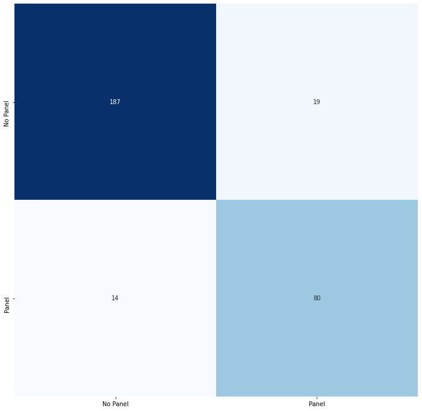

# solar-panel-classification
Solar panels have been a popular source of energy as increasing concerns of climate change have come to the forefront of people's minds. With the recent increase of solar panel installation, policy makers and energy producers need to understand the number and distribution of said panels in order to make more informed decsions.

The purpose of this project was to use deep learning methods in order to classify images of solar panels on rooftops. Using a CNN and fully connected layers an accuracy of 89% was achieved. Further improvments can be made to this model.

